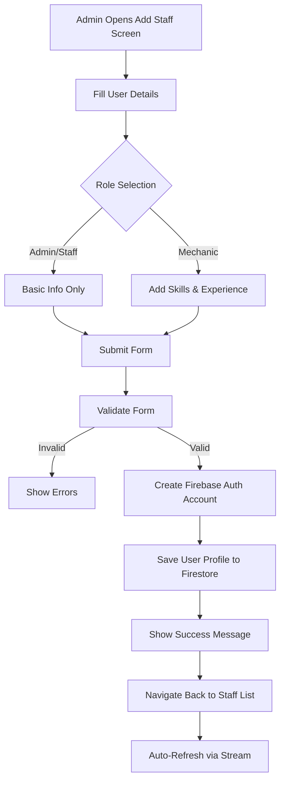
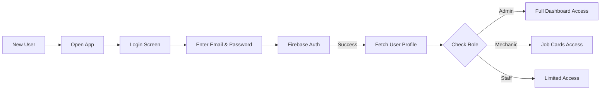

# Admin Staff Management Guide

## Overview
The Admin Staff Management module allows administrators to create, manage, and assign roles to staff members and mechanics in the AutoCare Pro garage management system.

---

## 🎯 Key Features

### ✅ User Account Creation
- Create accounts for staff and mechanics
- Set unique email addresses for login
- Assign secure passwords (manual or auto-generated)
- Add phone numbers for contact

### ✅ Role-Based Access Control
Three distinct roles with different permissions:

| Role | Icon | Permissions | Use Case |
|------|------|-------------|----------|
| **Admin** | 🛡️ Admin Panel | Full system access | Garage owners, managers |
| **Mechanic** | 🔧 Handyman | Job assignments, status updates | Service technicians |
| **Staff** | 👤 Person | General access | Front desk, support staff |

### ✅ Mechanic-Specific Features
- **Skills Management**: Select from predefined skills
  - Engine
  - Electrical
  - Body
  - Accessories
  - Paint
  - Washing
- **Experience Tracking**: Record years of experience
- **Job Assignment**: Assign mechanics to specific job cards

### ✅ Advanced Features
- **Password Auto-Generation**: Secure 12-character passwords
- **Password Visibility Toggle**: Show/hide password while typing
- **Copy to Clipboard**: Easy password sharing
- **Role Filtering**: Filter staff list by role
- **Status Tracking**: Active/Inactive user status
- **Real-time Updates**: Instant list updates via Firestore streams

---

## 📱 User Interface

### Add Staff/Mechanic Screen

#### Basic Information Section
```
┌─────────────────────────────────────┐
│  📋 Create New User                 │
│  Add staff or mechanic to garage    │
└─────────────────────────────────────┘

Basic Information
├─ Full Name *
├─ Email Address *
├─ Phone Number
└─ Password * [👁️ Show] [🔄 Generate]
```

#### Role & Permissions Section
```
Role & Permissions
└─ Select Role *
   ├─ 🛡️ ADMIN - Full system access
   ├─ 🔧 MECHANIC - Service & repair work
   └─ 👤 STAFF - General staff member
```

#### Mechanic Details (Conditional)
```
Mechanic Details
├─ Years of Experience
└─ Skills & Expertise
   ├─ [✓] Engine
   ├─ [✓] Electrical
   ├─ [ ] Body
   ├─ [ ] Accessories
   ├─ [ ] Paint
   └─ [ ] Washing
```

### Staff List Screen

#### Features
- **Filter Menu**: Filter by All/Admin/Mechanic/Staff
- **Floating Action Button**: Quick add new staff
- **Card Layout**: Detailed staff information cards

#### Staff Card Display
```
┌──────────────────────────────────────────┐
│  🔧  John Doe                   ● Active │
│     MECHANIC                             │
├──────────────────────────────────────────┤
│  📧 john.doe@garage.com                  │
│  📱 9876543210                           │
├──────────────────────────────────────────┤
│  📅 5 years experience                   │
│  🔧 Engine | Electrical | Body           │
└──────────────────────────────────────────┘
```

---

## 🔐 Security Features

### Password Management

#### Manual Password Entry
- Minimum 6 characters required
- Password visibility toggle
- Real-time validation

#### Auto-Generated Passwords
- **Length**: 12 characters
- **Complexity**: Uppercase, lowercase, numbers, special characters
- **Character Set**: `a-z A-Z 0-9 !@#$%^&*`
- **Security**: Uses `Random.secure()` for cryptographic randomness

**Example Generated Password**: `aB3!xY9@mK2$`

#### Password Sharing Workflow
1. Admin generates password
2. Password displayed in snackbar for 5 seconds
3. Admin clicks "Copy" to copy to clipboard
4. Admin securely shares with new user (SMS, WhatsApp, in-person)
5. User logs in with email and password
6. User should change password after first login (future feature)

---

## 📊 Data Flow

### Creating a New Staff Member



### Authentication Flow for New User



---

## 💻 Code Implementation

### Creating a User (Admin Function)

```dart
// In Add User Screen
Future<void> _createUser() async {
  if (!_formKey.currentState!.validate()) return;
  
  setState(() => _isLoading = true);

  try {
    // Create Firebase Auth account + Firestore profile
    await ref.read(authRepositoryProvider).signUpWithEmail(
      email: _emailController.text.trim(),
      password: _passwordController.text.trim(),
      role: _selectedRole,
      name: _nameController.text.trim(),
      skills: _selectedSkills,
      experience: _experience,
    );

    if (mounted) {
      ScaffoldMessenger.of(context).showSnackBar(
        const SnackBar(content: Text('User created successfully!')),
      );
      Navigator.pop(context);
    }
  } catch (e) {
    // Handle error
    ScaffoldMessenger.of(context).showSnackBar(
      SnackBar(content: Text('Error: $e')),
    );
  } finally {
    setState(() => _isLoading = false);
  }
}
```

### Auto-Generate Password

```dart
String _generatePassword() {
  const chars = 'abcdefghijklmnopqrstuvwxyzABCDEFGHIJKLMNOPQRSTUVWXYZ0123456789!@#\$%^&*';
  final random = Random.secure();
  return List.generate(12, (index) => chars[random.nextInt(chars.length)]).join();
}

// Usage
final password = _generatePassword();
_passwordController.text = password;

// Copy to clipboard
Clipboard.setData(ClipboardData(text: password));
```

### Filter Staff by Role

```dart
// In Staff List Screen
final filteredList = _filterRole == 'all'
    ? staffList
    : staffList.where((user) => user.role == _filterRole).toList();
```

---

## 🗄️ Database Structure

### Firebase Auth
```
Authentication
└── Users
    ├── uid: "abc123"
    │   ├── email: "john@garage.com"
    │   └── password: (hashed)
    └── uid: "def456"
        ├── email: "jane@garage.com"
        └── password: (hashed)
```

### Firestore
```
users/
├── abc123/
│   ├── id: "abc123"
│   ├── email: "john@garage.com"
│   ├── name: "John Doe"
│   ├── role: "mechanic"
│   ├── mobile: "9876543210"
│   ├── status: "Active"
│   ├── skills: ["Engine", "Electrical"]
│   ├── experience: 5
│   └── createdAt: "2024-12-18T10:00:00Z"
└── def456/
    ├── id: "def456"
    ├── email: "jane@garage.com"
    ├── name: "Jane Smith"
    ├── role: "admin"
    ├── mobile: "9123456789"
    ├── status: "Active"
    ├── skills: []
    ├── experience: 0
    └── createdAt: "2024-12-18T11:00:00Z"
```

---

## 🎨 UI/UX Highlights

### Design Principles
- **Clean & Modern**: Card-based layout with rounded corners
- **Color-Coded Roles**: 
  - Admin: Red (🔴)
  - Mechanic: Blue (🔵)
  - Staff: Green (🟢)
- **Status Indicators**: Active (green dot) / Inactive (gray dot)
- **Responsive**: Adapts to different screen sizes
- **Intuitive Icons**: Clear visual representation of roles and actions

### User Experience Features
1. **Form Validation**: Real-time error messages
2. **Loading States**: Progress indicators during operations
3. **Success Feedback**: Snackbar notifications
4. **Empty States**: Helpful messages when no data
5. **Error Handling**: User-friendly error messages
6. **Accessibility**: Proper labels and hints

---

## 📋 Admin Checklist

### Before Creating a User
- [ ] Verify email address is unique
- [ ] Determine appropriate role
- [ ] For mechanics: Identify skills and experience
- [ ] Prepare to securely share credentials

### After Creating a User
- [ ] Copy generated password
- [ ] Share credentials securely with user
- [ ] Verify user can login
- [ ] Assign mechanic to job cards (if applicable)
- [ ] Monitor user activity

---

## 🔮 Future Enhancements

### Planned Features
- [ ] Edit user details
- [ ] Deactivate/reactivate users
- [ ] Reset password functionality
- [ ] User activity logs
- [ ] Permission customization
- [ ] Bulk user import
- [ ] Email notifications to new users
- [ ] Force password change on first login
- [ ] Two-factor authentication
- [ ] User profile pictures

---

## 🆘 Troubleshooting

### Common Issues

#### User Creation Fails
**Problem**: Error creating user account

**Solutions**:
- Check internet connection
- Verify email is not already in use
- Ensure password meets minimum requirements
- Check Firebase Auth is properly configured

#### User Can't Login
**Problem**: New user unable to login

**Solutions**:
- Verify email and password are correct
- Check user status is "Active"
- Ensure Firebase Auth is enabled
- Check Firestore security rules

#### Skills Not Saving
**Problem**: Mechanic skills not appearing

**Solutions**:
- Ensure skills are selected before submitting
- Check Firestore write permissions
- Verify data model includes skills field

---

## 📞 Support

For technical issues or questions:
1. Check Firebase Console for errors
2. Review Firestore security rules
3. Verify user permissions
4. Contact system administrator

---

**Last Updated**: December 18, 2024  
**Version**: 1.0.0  
**Module**: Admin Staff Management
