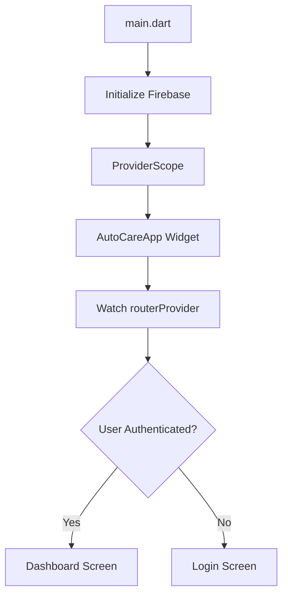
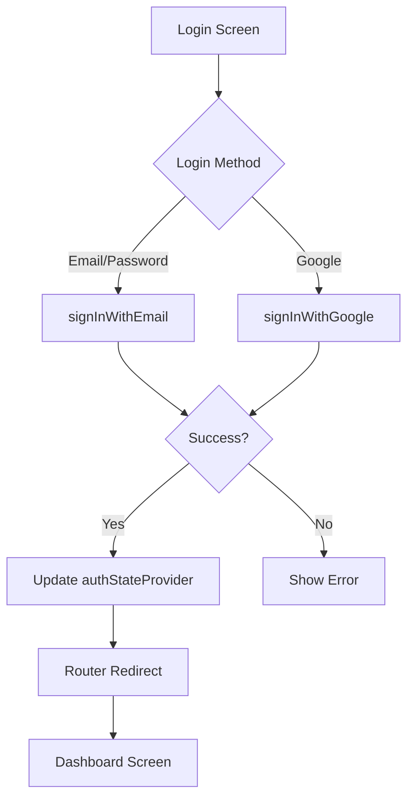
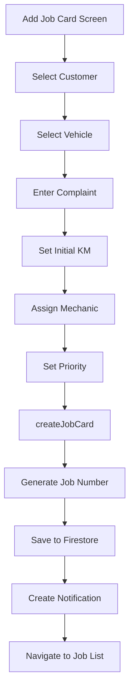
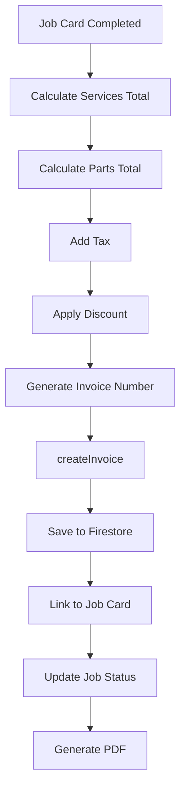
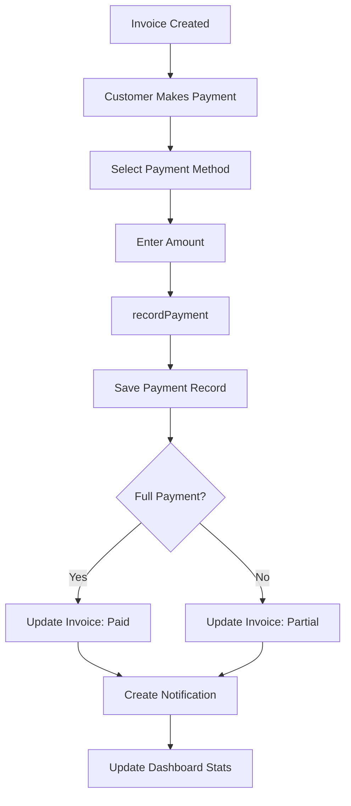
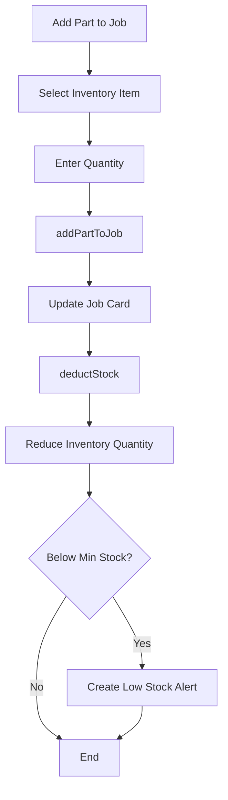

# AutoCare Pro - Architecture Documentation

## 📋 Table of Contents
- [Project Overview](#project-overview)
- [Technology Stack](#technology-stack)
- [Project Structure](#project-structure)
- [Data Models](#data-models)
- [Core Repositories](#core-repositories)
- [State Management](#state-management)
- [Navigation & Routing](#navigation--routing)
- [Feature Modules](#feature-modules)
- [Code Flow Diagrams](#code-flow-diagrams)
- [Firebase Collections](#firebase-collections)
- [Key Functions Reference](#key-functions-reference)

---

## 🎯 Project Overview

**AutoCare Pro** is a comprehensive garage management system built with Flutter. It manages customers, vehicles, job cards, inventory, billing, staff, and reporting for automotive service centers.

### Core Features
- 🔐 **Authentication** - Email/Password & Google Sign-In
- 👥 **Customer Management** - Add, edit, search customers
- 🚗 **Vehicle Management** - Track customer vehicles
- 📝 **Job Card System** - Service tracking from receipt to delivery
- 💰 **Billing & Invoicing** - Generate invoices and track payments
- 📦 **Inventory Management** - Spare parts stock control
- 👨‍🔧 **Staff Management** - Mechanic assignment and tracking
- 📊 **Dashboard & Reports** - Business analytics
- 🔔 **Notifications** - Real-time status updates

---

## 🛠 Technology Stack

### Frontend
- **Framework**: Flutter 3.9.2+
- **Language**: Dart
- **State Management**: Riverpod 3.0.3
- **Navigation**: GoRouter 17.0.1

### Backend & Services
- **Authentication**: Firebase Auth 6.1.3
- **Database**: Cloud Firestore 6.1.1
- **Storage**: Firebase Storage 13.0.5
- **Google Sign-In**: 6.2.1

### UI & Utilities
- **Fonts**: Google Fonts 6.3.3
- **PDF Generation**: pdf 3.11.3, printing 5.14.2
- **Image Picker**: 1.2.1
- **Date Formatting**: intl 0.20.2
- **UUID Generation**: uuid 4.5.2

---

## 📁 Project Structure

```
lib/
├── core/
│   ├── router/
│   │   └── app_router.dart          # Navigation configuration
│   └── theme/
│       └── app_theme.dart            # App theming
│
├── data/
│   ├── models/                       # Data models
│   │   ├── customer_model.dart
│   │   ├── vehicle_model.dart
│   │   ├── job_card_model.dart
│   │   ├── service_model.dart
│   │   ├── inventory_model.dart
│   │   ├── invoice_model.dart
│   │   ├── payment_model.dart
│   │   ├── user_model.dart
│   │   ├── notification_model.dart
│   │   └── settings_model.dart
│   │
│   └── repositories/                 # Data access layer
│       ├── auth_repository.dart
│       ├── garage_repository.dart
│       └── user_repository.dart
│
├── presentation/
│   ├── controllers/
│   │   └── dashboard_controller.dart
│   │
│   └── screens/
│       ├── auth/
│       │   ├── login_screen.dart
│       │   └── forgot_password_screen.dart
│       ├── dashboard/
│       │   └── dashboard_screen.dart
│       ├── customers/
│       │   ├── customer_list_screen.dart
│       │   └── add_customer_screen.dart
│       ├── vehicles/
│       │   ├── vehicle_list_screen.dart
│       │   ├── add_vehicle_screen.dart
│       │   └── vehicle_detail_screen.dart
│       ├── job_cards/
│       │   ├── job_card_list_screen.dart
│       │   ├── add_job_card_screen.dart
│       │   └── job_card_detail_screen.dart
│       ├── billing/
│       │   ├── invoice_screen.dart
│       │   └── add_service_part_screen.dart
│       ├── inventory/
│       │   ├── inventory_list_screen.dart
│       │   └── add_spare_part_screen.dart
│       ├── staff/
│       │   └── staff_list_screen.dart
│       ├── admin/
│       │   └── add_user_screen.dart
│       ├── notifications/
│       │   └── notification_list_screen.dart
│       ├── reports/
│       │   └── reports_dashboard_screen.dart
│       └── settings/
│           └── settings_screen.dart
│
├── firebase_options.dart             # Firebase configuration
└── main.dart                         # App entry point
```

---

## 📊 Data Models

### 1. Customer Model
```dart
class Customer {
  final String id;
  final String name;
  final String mobile;
  final String? email;
  final String? address;
  final String? gender;
  final String status;        // 'Active', 'Inactive'
  final DateTime createdAt;
}
```

**Key Methods:**
- `toMap()` - Convert to Firestore document
- `fromMap(Map, String id)` - Create from Firestore document

---

### 2. Vehicle Model
```dart
class Vehicle {
  final String id;
  final String customerId;
  final String number;        // Registration number
  final String brand;
  final String model;
  final String vehicleType;   // Car, Bike, Other
  final String fuelType;
  final String year;
  final int currentKm;
  final String status;        // Active, Sold
  final DateTime createdAt;
}
```

---

### 3. Job Card Model
```dart
class JobCard {
  final String id;
  final String jobNo;
  final String vehicleId;
  final String customerId;
  final List<String> mechanicIds;
  final String status;        // Received, Inspection, InProgress, Completed, Delivered
  final String priority;      // Low, Medium, High
  final DateTime date;
  final DateTime? estimatedDeliveryDate;
  final String complaint;
  final int initialKm;
  final int? finalKm;
  final double totalAmount;
  final String? notes;
  final List<JobService> selectedServices;
  final List<JobPart> selectedParts;
}
```

**Sub-Models:**
```dart
class JobService {
  final String id;
  final String name;
  final double price;
}

class JobPart {
  final String id;
  final String name;
  final double price;
  final int quantity;
}
```

---

### 4. Service Model
```dart
class Service {
  final String id;
  final String name;
  final String category;
  final double price;
  final int estimatedTime;    // in minutes
  final String description;
}
```

---

### 5. Inventory Model
```dart
class InventoryItem {
  final String id;
  final String name;
  final String category;
  final String brand;
  final int quantity;
  final int minStockLevel;
  final double purchasePrice;
  final double sellingPrice;
  final String? supplier;
  final DateTime createdAt;
}
```

---

### 6. Invoice Model
```dart
class Invoice {
  final String id;
  final String invoiceNo;
  final String jobId;
  final String customerId;
  final DateTime date;
  final double subtotal;
  final double tax;
  final double discount;
  final double total;
  final String paymentStatus;  // Paid, Partial, Unpaid
  final List<InvoiceItem> items;
}
```

---

### 7. Payment Model
```dart
class Payment {
  final String id;
  final String invoiceId;
  final double amount;
  final String method;         // Cash, Card, UPI, Bank Transfer
  final DateTime date;
  final String? reference;
  final String? notes;
}
```

---

### 8. User Model
```dart
class UserModel {
  final String id;
  final String email;
  final String name;
  final String role;           // admin, staff, mechanic, customer
  final DateTime createdAt;
  final String? phone;
  final String status;         // Active, Inactive
  final List<String> skills;   // For mechanics
  final int experience;        // Years of experience
}
```

---

### 9. Notification Model
```dart
class GarageNotification {
  final String id;
  final String userId;
  final String title;
  final String message;
  final String type;           // job_update, payment, inventory, etc.
  final DateTime createdAt;
  final bool isRead;
  final Map<String, dynamic>? data;
}
```

---

### 10. Settings Model
```dart
class GarageSettings {
  final String id;
  final String garageName;
  final String address;
  final String phone;
  final String email;
  final String gstNumber;
  final double taxRate;
  final String currency;
  final String? logo;
}
```

---

## 🔐 Core Repositories

### AuthRepository

**Location**: `lib/data/repositories/auth_repository.dart`

**Purpose**: Handles all authentication operations

#### Key Functions

| Function | Parameters | Returns | Description |
|----------|-----------|---------|-------------|
| `signInWithEmail` | `email: String`<br>`password: String` | `Future<UserCredential>` | Email/password login |
| `signUpWithEmail` | `email: String`<br>`password: String`<br>`role: String`<br>`name: String`<br>`skills: List<String>`<br>`experience: int` | `Future<void>` | Create new user account |
| `signInWithGoogle` | - | `Future<UserCredential?>` | Google OAuth login |
| `sendPasswordResetEmail` | `email: String` | `Future<void>` | Send password reset link |
| `getUserRole` | `uid: String` | `Future<String?>` | Get user's role from Firestore |
| `signOut` | - | `Future<void>` | Sign out current user |

#### Providers
```dart
// Repository instance
final authRepositoryProvider = Provider<AuthRepository>((ref) {
  return AuthRepository(FirebaseAuth.instance, GoogleSignIn());
});

// Auth state stream
final authStateProvider = StreamProvider<User?>((ref) {
  return ref.watch(authRepositoryProvider).authStateChanges;
});
```

---

### GarageRepository

**Location**: `lib/data/repositories/garage_repository.dart`

**Purpose**: Main business logic repository for all garage operations

#### Customer Operations

| Function | Parameters | Returns | Description |
|----------|-----------|---------|-------------|
| `getCustomers` | - | `Stream<List<Customer>>` | Real-time customer list |
| `addCustomer` | `customer: Customer` | `Future<void>` | Add new customer |
| `updateCustomer` | `customer: Customer` | `Future<void>` | Update customer details |
| `deleteCustomer` | `id: String` | `Future<void>` | Delete customer |
| `searchCustomers` | `query: String` | `Future<List<Customer>>` | Search by name/mobile |

#### Vehicle Operations

| Function | Parameters | Returns | Description |
|----------|-----------|---------|-------------|
| `getVehicles` | `customerId: String?` | `Stream<List<Vehicle>>` | Get all or customer vehicles |
| `addVehicle` | `vehicle: Vehicle` | `Future<void>` | Add new vehicle |
| `updateVehicle` | `vehicle: Vehicle` | `Future<void>` | Update vehicle details |
| `searchVehicles` | `query: String`<br>`customerId: String?` | `Future<List<Vehicle>>` | Search vehicles |

#### Job Card Operations

| Function | Parameters | Returns | Description |
|----------|-----------|---------|-------------|
| `getJobCards` | - | `Stream<List<JobCard>>` | Real-time job card list |
| `getJobCardsByVehicleId` | `vehicleId: String` | `Stream<List<JobCard>>` | Get vehicle job history |
| `createJobCard` | `jobCard: JobCard` | `Future<void>` | Create new job card |
| `updateJobStatus` | `id: String`<br>`status: String` | `Future<void>` | Update job status |
| `closeJobCard` | `id: String`<br>`finalKm: int`<br>`remarks: String` | `Future<void>` | Mark job as delivered |
| `addServiceToJob` | `jobId: String`<br>`service: JobService` | `Future<void>` | Add service to job |
| `addPartToJob` | `jobId: String`<br>`part: JobPart` | `Future<void>` | Add part to job |
| `updateJobStatusWithNotification` | `job: JobCard`<br>`newStatus: String` | `Future<void>` | Update status + notify customer |

#### Service Operations

| Function | Parameters | Returns | Description |
|----------|-----------|---------|-------------|
| `getServices` | - | `Future<List<Service>>` | Get all available services |

#### Billing Operations

| Function | Parameters | Returns | Description |
|----------|-----------|---------|-------------|
| `createInvoice` | `invoice: Invoice` | `Future<void>` | Generate invoice |
| `getInvoices` | `jobId: String?` | `Stream<List<Invoice>>` | Get invoices |
| `recordPayment` | `payment: Payment` | `Future<void>` | Record payment + update invoice |

#### Inventory Operations

| Function | Parameters | Returns | Description |
|----------|-----------|---------|-------------|
| `getInventory` | `category: String?` | `Stream<List<InventoryItem>>` | Get inventory items |
| `addInventoryItem` | `item: InventoryItem` | `Future<void>` | Add new spare part |
| `updateInventoryItem` | `item: InventoryItem` | `Future<void>` | Update inventory item |
| `deductStock` | `itemId: String`<br>`qty: int` | `Future<void>` | Reduce stock quantity |

#### Staff Operations

| Function | Parameters | Returns | Description |
|----------|-----------|---------|-------------|
| `getStaff` | - | `Stream<List<UserModel>>` | Get all staff/mechanics |

#### Notification Operations

| Function | Parameters | Returns | Description |
|----------|-----------|---------|-------------|
| `createNotification` | `notification: GarageNotification` | `Future<void>` | Create notification |
| `getNotifications` | `userId: String` | `Stream<List<GarageNotification>>` | Get user notifications |

#### Analytics & Reports

| Function | Parameters | Returns | Description |
|----------|-----------|---------|-------------|
| `getIncomeStats` | `startDate: DateTime?`<br>`endDate: DateTime?` | `Future<Map<String, dynamic>>` | Income analytics |
| `getMechanicJobCounts` | - | `Future<Map<String, int>>` | Jobs per mechanic |
| `getInventoryStats` | - | `Future<Map<String, dynamic>>` | Low stock alerts |

#### Settings Operations

| Function | Parameters | Returns | Description |
|----------|-----------|---------|-------------|
| `getSettings` | - | `Future<GarageSettings?>` | Get garage settings |
| `updateSettings` | `settings: GarageSettings` | `Future<void>` | Update settings |

#### Provider
```dart
final garageRepositoryProvider = Provider<GarageRepository>((ref) {
  return GarageRepository(FirebaseFirestore.instance);
});
```

---

## 🎮 State Management

### Riverpod Providers

#### Dashboard Controller
**Location**: `lib/presentation/controllers/dashboard_controller.dart`

```dart
class DashboardStats {
  final int totalCustomers;
  final int activeJobs;
  final double todayIncome;
}

final dashboardStatsProvider = FutureProvider<DashboardStats>((ref) async {
  // Fetches:
  // 1. Total customers count
  // 2. Active jobs count (status != Delivered)
  // 3. Today's total income from invoices
});
```

---

## 🧭 Navigation & Routing

### GoRouter Configuration
**Location**: `lib/core/router/app_router.dart`

#### Route Structure

```dart
final routerProvider = Provider<GoRouter>((ref) {
  final authState = ref.watch(authStateProvider);
  
  return GoRouter(
    initialLocation: '/',
    redirect: (context, state) {
      // Redirect logic based on auth state
    },
    routes: [...]
  );
});
```

#### Available Routes

| Route | Screen | Description |
|-------|--------|-------------|
| `/` | DashboardScreen | Main dashboard |
| `/login` | LoginScreen | Login page |
| `/customers` | CustomerListScreen | Customer list |
| `/customers/add` | AddCustomerScreen | Add customer |
| `/job-cards` | JobCardListScreen | Job card list |
| `/job-cards/add` | AddJobCardScreen | Create job card |
| `/vehicles` | VehicleListScreen | Vehicle list |
| `/vehicles/add` | AddVehicleScreen | Add vehicle |
| `/add-user` | AddUserScreen | Add staff/user |

#### Authentication Guard
```dart
redirect: (context, state) {
  final isLoggedIn = authState.value != null;
  final isLoggingIn = state.uri.toString() == '/login';
  
  if (!isLoggedIn && !isLoggingIn) return '/login';
  if (isLoggedIn && isLoggingIn) return '/';
  
  return null;
}
```

---

## 🎨 Feature Modules

### 1. Authentication Module

**Screens:**
- Login Screen
- Forgot Password Screen

**Flow:**
1. User enters credentials
2. `AuthRepository.signInWithEmail()` called
3. On success, `authStateProvider` updates
4. Router redirects to dashboard
5. User data fetched from Firestore

---

### 2. Customer Management

**Screens:**
- Customer List Screen
- Add Customer Screen

**Flow:**
1. View customers via `GarageRepository.getCustomers()`
2. Search using `searchCustomers(query)`
3. Add new customer via `addCustomer(customer)`
4. Update using `updateCustomer(customer)`
5. Delete using `deleteCustomer(id)`

---

### 3. Vehicle Management

**Screens:**
- Vehicle List Screen
- Add Vehicle Screen
- Vehicle Detail Screen

**Flow:**
1. View vehicles via `getVehicles(customerId: id)`
2. Add vehicle linked to customer
3. Track service history per vehicle
4. Update vehicle details

---

### 4. Job Card System

**Screens:**
- Job Card List Screen
- Add Job Card Screen
- Job Card Detail Screen

**Workflow:**
```
1. Customer brings vehicle
   ↓
2. Create Job Card (status: Received)
   - Record initial KM
   - Note complaint
   - Assign mechanic(s)
   ↓
3. Inspection (status: Inspection)
   ↓
4. Add Services & Parts
   - Select from service catalog
   - Add spare parts from inventory
   ↓
5. Work In Progress (status: InProgress)
   ↓
6. Work Completed (status: Completed)
   ↓
7. Generate Invoice
   ↓
8. Delivered (status: Delivered)
   - Record final KM
   - Add remarks
```

**Status Flow:**
`Received` → `Inspection` → `InProgress` → `Completed` → `Delivered`

---

### 5. Billing & Invoicing

**Screens:**
- Invoice Screen
- Add Service/Part Screen

**Flow:**
1. Job completed
2. Calculate total (services + parts + tax - discount)
3. Generate invoice via `createInvoice(invoice)`
4. Record payment via `recordPayment(payment)`
5. Update invoice status (Paid/Partial/Unpaid)
6. Generate PDF invoice

---

### 6. Inventory Management

**Screens:**
- Inventory List Screen
- Add Spare Part Screen

**Flow:**
1. View inventory via `getInventory(category: category)`
2. Add new items via `addInventoryItem(item)`
3. Update stock levels
4. Auto-deduct when parts used in job
5. Low stock alerts when `quantity < minStockLevel`

---

### 7. Staff Management

**Screens:**
- Staff List Screen (with role filtering)
- Add User Screen (Enhanced)

**Features:**
- ✅ Admin can create new staff/mechanic accounts
- ✅ Assign roles (Admin, Mechanic, Staff)
- ✅ Set email and password credentials
- ✅ Auto-generate secure passwords
- ✅ Add phone numbers
- ✅ For mechanics: Add skills and experience
- ✅ Filter staff by role
- ✅ View detailed staff information
- ✅ Active/Inactive status tracking

**Flow:**
1. Admin navigates to Staff List Screen
2. Click "Add Staff" button
3. Fill in user details:
   - Full name
   - Email address (used for login)
   - Phone number (optional)
   - Password (manual or auto-generate)
   - Select role (Admin/Mechanic/Staff)
4. If Mechanic role:
   - Enter years of experience
   - Select skills (Engine, Electrical, Body, etc.)
5. Submit to create user account
6. User credentials saved to Firebase Auth
7. User profile saved to Firestore
8. New user can login with email/password
9. View all staff with filtering options

**Password Management:**
- Manual entry (minimum 6 characters)
- Auto-generate secure 12-character password
- Password visibility toggle
- Copy generated password to clipboard
- Admin should securely share credentials with new user

**Role Permissions:**
- **Admin**: Full system access, can manage all features
- **Mechanic**: Assigned to job cards, can update job status
- **Staff**: General access, limited permissions


---

### 8. Dashboard & Reports

**Screens:**
- Dashboard Screen
- Reports Dashboard Screen

**Metrics:**
- Total customers
- Active jobs
- Today's income
- Monthly revenue
- Mechanic performance
- Inventory alerts

---

## 📊 Code Flow Diagrams

### Application Startup Flow



### Authentication Flow



### Job Card Creation Flow



### Invoice Generation Flow



### Payment Recording Flow



### Inventory Deduction Flow



---

## 🗄️ Firebase Collections

### Collection Structure

```
firestore/
├── users/
│   └── {userId}
│       ├── id: string
│       ├── email: string
│       ├── name: string
│       ├── role: string
│       ├── phone: string
│       ├── status: string
│       ├── skills: array
│       ├── experience: number
│       └── createdAt: timestamp
│
├── customers/
│   └── {customerId}
│       ├── name: string
│       ├── mobile: string
│       ├── email: string
│       ├── address: string
│       ├── gender: string
│       ├── status: string
│       └── createdAt: timestamp
│
├── vehicles/
│   └── {vehicleId}
│       ├── customerId: string
│       ├── number: string
│       ├── brand: string
│       ├── model: string
│       ├── vehicleType: string
│       ├── fuelType: string
│       ├── year: string
│       ├── currentKm: number
│       ├── status: string
│       └── createdAt: timestamp
│
├── job_cards/
│   └── {jobId}
│       ├── jobNo: string
│       ├── vehicleId: string
│       ├── customerId: string
│       ├── mechanicIds: array
│       ├── status: string
│       ├── priority: string
│       ├── date: timestamp
│       ├── estimatedDeliveryDate: timestamp
│       ├── complaint: string
│       ├── initialKm: number
│       ├── finalKm: number
│       ├── totalAmount: number
│       ├── notes: string
│       ├── selectedServices: array
│       └── selectedParts: array
│
├── services/
│   └── {serviceId}
│       ├── name: string
│       ├── category: string
│       ├── price: number
│       ├── estimatedTime: number
│       └── description: string
│
├── inventory/
│   └── {itemId}
│       ├── name: string
│       ├── category: string
│       ├── brand: string
│       ├── quantity: number
│       ├── minStockLevel: number
│       ├── purchasePrice: number
│       ├── sellingPrice: number
│       ├── supplier: string
│       └── createdAt: timestamp
│
├── invoices/
│   └── {invoiceId}
│       ├── invoiceNo: string
│       ├── jobId: string
│       ├── customerId: string
│       ├── date: timestamp
│       ├── subtotal: number
│       ├── tax: number
│       ├── discount: number
│       ├── total: number
│       ├── paymentStatus: string
│       └── items: array
│
├── payments/
│   └── {paymentId}
│       ├── invoiceId: string
│       ├── amount: number
│       ├── method: string
│       ├── date: timestamp
│       ├── reference: string
│       └── notes: string
│
├── notifications/
│   └── {notificationId}
│       ├── userId: string
│       ├── title: string
│       ├── message: string
│       ├── type: string
│       ├── createdAt: timestamp
│       ├── isRead: boolean
│       └── data: map
│
└── settings/
    └── garage_settings
        ├── garageName: string
        ├── address: string
        ├── phone: string
        ├── email: string
        ├── gstNumber: string
        ├── taxRate: number
        ├── currency: string
        └── logo: string
```

---

## 🔧 Key Functions Reference

### Quick Function Lookup

#### Authentication
```dart
// Sign in
await authRepository.signInWithEmail(email, password);

// Sign up
await authRepository.signUpWithEmail(
  email: email,
  password: password,
  role: 'mechanic',
  name: name,
  skills: ['Engine', 'Transmission'],
  experience: 5,
);

// Google sign in
await authRepository.signInWithGoogle();

// Password reset
await authRepository.sendPasswordResetEmail(email);

// Sign out
await authRepository.signOut();
```

#### Customer Management
```dart
// Get all customers (Stream)
garageRepository.getCustomers();

// Add customer
await garageRepository.addCustomer(customer);

// Update customer
await garageRepository.updateCustomer(customer);

// Delete customer
await garageRepository.deleteCustomer(customerId);

// Search customers
final results = await garageRepository.searchCustomers('John');
```

#### Vehicle Management
```dart
// Get all vehicles (Stream)
garageRepository.getVehicles();

// Get customer vehicles
garageRepository.getVehicles(customerId: customerId);

// Add vehicle
await garageRepository.addVehicle(vehicle);

// Search vehicles
final results = await garageRepository.searchVehicles('MH12AB1234');
```

#### Job Card Management
```dart
// Get all job cards (Stream)
garageRepository.getJobCards();

// Get vehicle job history
garageRepository.getJobCardsByVehicleId(vehicleId);

// Create job card
await garageRepository.createJobCard(jobCard);

// Update status
await garageRepository.updateJobStatus(jobId, 'InProgress');

// Add service to job
await garageRepository.addServiceToJob(jobId, service);

// Add part to job
await garageRepository.addPartToJob(jobId, part);

// Close job card
await garageRepository.closeJobCard(jobId, finalKm, remarks);

// Update with notification
await garageRepository.updateJobStatusWithNotification(job, 'Completed');
```

#### Billing
```dart
// Create invoice
await garageRepository.createInvoice(invoice);

// Get invoices (Stream)
garageRepository.getInvoices();

// Get job invoices
garageRepository.getInvoices(jobId: jobId);

// Record payment
await garageRepository.recordPayment(payment);
```

#### Inventory
```dart
// Get all inventory (Stream)
garageRepository.getInventory();

// Get by category
garageRepository.getInventory(category: 'Engine Parts');

// Add item
await garageRepository.addInventoryItem(item);

// Update item
await garageRepository.updateInventoryItem(item);

// Deduct stock
await garageRepository.deductStock(itemId, quantity);
```

#### Analytics
```dart
// Get income stats
final stats = await garageRepository.getIncomeStats(
  startDate: DateTime(2024, 1, 1),
  endDate: DateTime(2024, 12, 31),
);

// Get mechanic job counts
final counts = await garageRepository.getMechanicJobCounts();

// Get inventory stats
final inventoryStats = await garageRepository.getInventoryStats();
```

#### Dashboard
```dart
// Get dashboard stats
ref.watch(dashboardStatsProvider);
// Returns: DashboardStats(totalCustomers, activeJobs, todayIncome)
```

---

## 🚀 Common Workflows

### Complete Job Card Workflow

```dart
// 1. Create Job Card
final jobCard = JobCard(
  id: uuid.v4(),
  jobNo: 'JOB-${DateTime.now().millisecondsSinceEpoch}',
  vehicleId: selectedVehicle.id,
  customerId: selectedCustomer.id,
  mechanicIds: [selectedMechanic.id],
  status: 'Received',
  priority: 'Medium',
  date: DateTime.now(),
  complaint: 'Engine noise',
  initialKm: 45000,
  selectedServices: [],
  selectedParts: [],
);
await garageRepository.createJobCard(jobCard);

// 2. Update to Inspection
await garageRepository.updateJobStatusWithNotification(
  jobCard,
  'Inspection',
);

// 3. Add Services
final service = JobService(
  id: serviceId,
  name: 'Oil Change',
  price: 500.0,
);
await garageRepository.addServiceToJob(jobCard.id, service);

// 4. Add Parts
final part = JobPart(
  id: partId,
  name: 'Engine Oil',
  price: 800.0,
  quantity: 2,
);
await garageRepository.addPartToJob(jobCard.id, part);

// 5. Update to InProgress
await garageRepository.updateJobStatus(jobCard.id, 'InProgress');

// 6. Complete Job
await garageRepository.updateJobStatus(jobCard.id, 'Completed');

// 7. Generate Invoice
final invoice = Invoice(
  id: uuid.v4(),
  invoiceNo: 'INV-${DateTime.now().millisecondsSinceEpoch}',
  jobId: jobCard.id,
  customerId: jobCard.customerId,
  date: DateTime.now(),
  subtotal: 2100.0,
  tax: 378.0,
  discount: 0.0,
  total: 2478.0,
  paymentStatus: 'Unpaid',
  items: [],
);
await garageRepository.createInvoice(invoice);

// 8. Record Payment
final payment = Payment(
  id: uuid.v4(),
  invoiceId: invoice.id,
  amount: 2478.0,
  method: 'Cash',
  date: DateTime.now(),
);
await garageRepository.recordPayment(payment);

// 9. Deliver Vehicle
await garageRepository.closeJobCard(
  jobCard.id,
  45250,
  'Vehicle serviced and delivered',
);
```

---

## 📝 Notes

### Firestore Indexes Required
- `job_cards`: Composite index on `status` (ascending) for `whereIn` queries
- `invoices`: Composite index on `date` (ascending) for range queries
- `inventory`: Index on `category` for filtering

### Security Rules Considerations
- Users can only access their own data based on role
- Admins have full access
- Mechanics can view assigned jobs
- Customers can view their own vehicles and job cards

### Future Enhancements
- [ ] Push notifications via FCM
- [ ] SMS notifications for job status
- [ ] WhatsApp integration
- [ ] Advanced reporting with charts
- [ ] Multi-garage support
- [ ] Employee attendance tracking
- [ ] Appointment scheduling
- [ ] Customer feedback system

---

## 📞 Support

For questions or issues, refer to the codebase or contact the development team.

---

**Last Updated**: December 2024  
**Version**: 1.0.0
